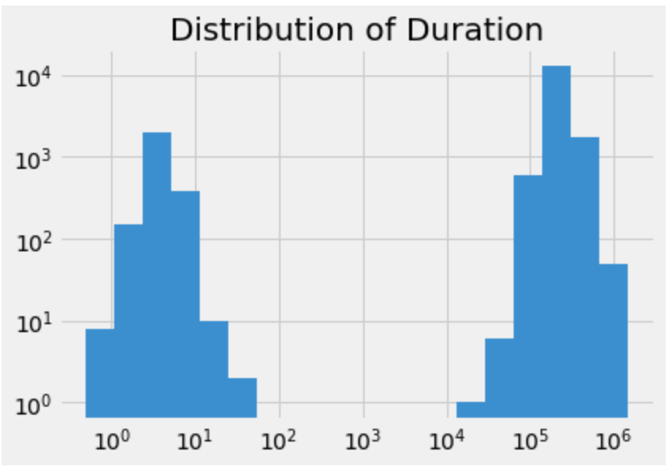
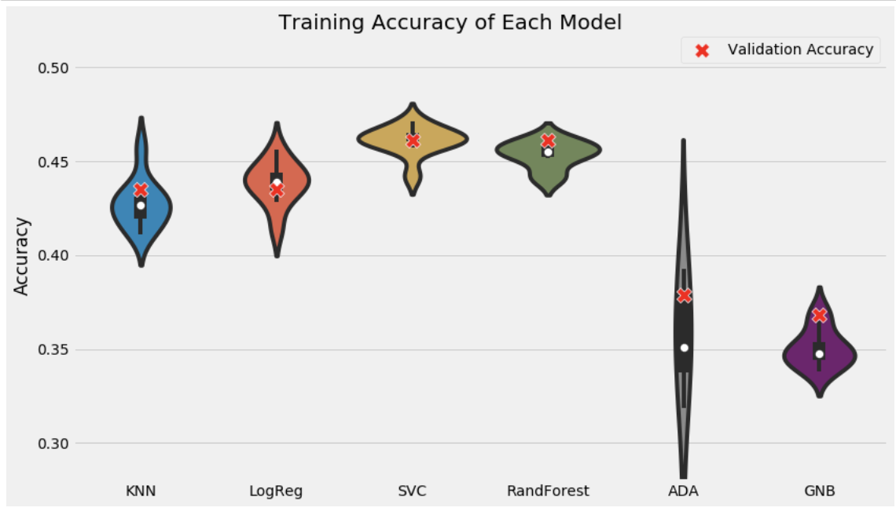
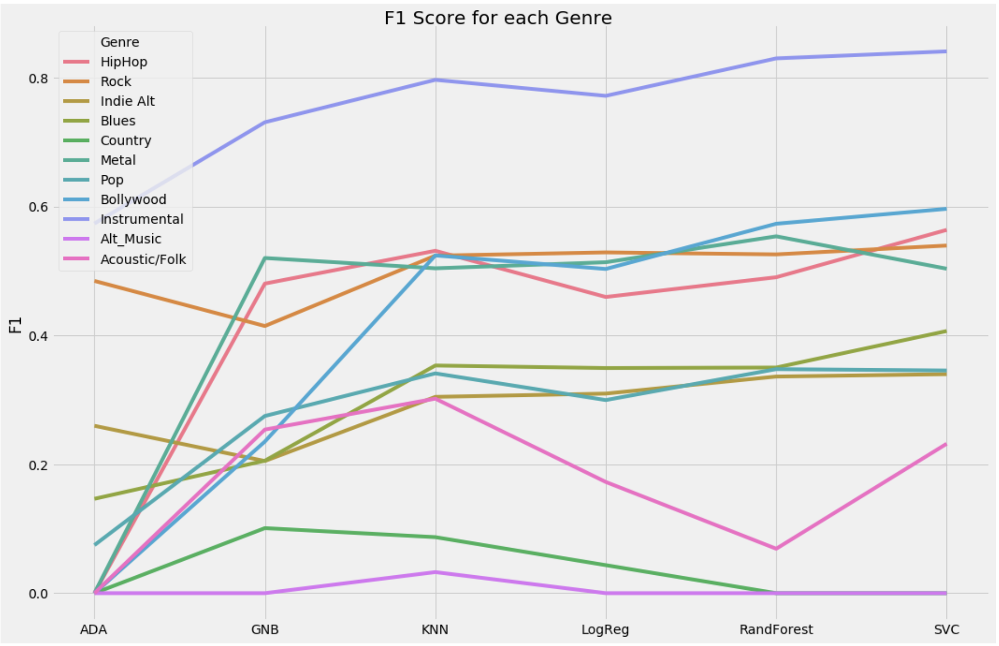

## Problem Overview

Music is typically classified into genres, such as pop, rock, or rap but defining these genres is very difficult. Can rap songs also be classified as pop? What if a rock song has rap in it? With the lack of standard definitions and so many different mixed genres, human classification is very unreliable for industry use. A perfect definition is not needed, but there needs to be a consistent grouping.

In order to do this, I downloaded a music dataset from [Kaggle](https://www.kaggle.com/purumalgi/music-genre-classification). This data includes 17,997 songs that are categorized into 1 of 11 genres. Each song has basic metadata provided as well as musical features. 

## Problem Statement

To solve this classification problem, I look into using machine learning. Using commonly discovered metadata, I attempt to classify songs into their attributed genre. I first clean and explore the data. This is followed by picking some models and training them on a sample of the data. From here, I will test the models on various metrics and decide which one is the best. Of the various models, I believe Random Forest will perform the best due to its simple rule-based procedure. The features in the dataset are relatively simple, thus I believe a Random Forest model will not over-complicate how the features are incorporated.

## Metrics

I focus on two metrics for choosing the best model. The first, accuracy, is the ratio of the number of correct guesses by the total number of guesses. The second, F1-score, is a metric to account for the contributions of precision and recall. The formula is shown below. 

$$F1 = \frac{2*(precision * recall)}{precision + recall}$$

Because this is a multi-class classification, an F1 score is calculated per genre. 

## Data Exploration

### Genres

In total, the dataset includes 11 features with the below frequencies:

| Genre      | Frequency |
| ----------- | ----------- |
| Rock      | 4949       |
| Indi Alt   | 2587        |
| Pop      | 2524       |
| Metal   | 1854        |
| HipHop      | 1447       |
| Alt_Music   | 1373        |
| Blues      | 1272       |
| Acoustic/Folk   | 625        |
| Instrumental      | 576       |
| Bollywood   | 402        |
| Country      | 387       |

There is a large class imbalance that will have to be accounted for when building the machine learning classifiers.

### Musical Features

There are 15 features in the dataset. A description from [Spotify](https://developer.spotify.com/discover/) of each feature is described below. 

| Feature      | Description | Feature      | Description |
| ----------- | ----------- | ----------- | ----------- |
| Artist Name      |  name of the artist| Track Name|name of the song|
| Popularity      | how popular the song is|Danceability| how well a song is suited for dancing|
| Energy      |a measure of intensity and activity in the song|Key|the musical key the song is in|
| Loudness      | the average decibels of the song|Speechiness|the presence of spoken word in the song|
| Acousticness      | how acoustic the song is|Instrumentalness|how much of the song consists of instrumentals|
| Liveness   | the probability of a song being recorded with a live audience| Valence |the amount of positivity in the song|
| Tempo |the speed of the song| Duration_in min/ms|the length of the song|
| Time_signature|the time signature of the song based on quarter notes

In order to have consistent data types, I limit features to those that are continuous. Basic statistics of the remaining features are shown below. 

|| Popularity      | Danceability | Energy      | Loudness | Speechiness      | Acousticeness | Instrumentalness      | Liveness | Valence      | Tempo | Duration_in min/ms      |
| ----------- | ----------- | ----------- | ----------- |----------- | ----------- | ----------- | ----------- |----------- | ----------- | ----------- | ----------- |
minimum	|1.000000	|0.059600	|0.000020	|-39.95200	|0.022500	|0.000000	|0.000001	|0.01190	|0.018300	|30.557000	|5.016500e-01
mean	|44.512124	|0.543433	|0.662777	|-7.91066	|0.079707	|0.247082	|0.177562	|0.19617	|0.486208	|122.623294	|2.007445e+05
median	|44.000000	|0.545000	|0.700000	|-7.01600	|0.047400	|0.081400	|0.003910	|0.12900	|0.481000	|120.065500	|2.091600e+05
maximum	|100.000000	|0.989000	|1.000000	|1.35500	|0.955000	|0.996000	|0.996000	|1.00000	|0.986000	|217.416000	|1.477187e+06

### Feature Summaries

When looking at the distribution of features, some interesting patterns emerge. Distributions are shown in Figure 2 (Data Visualizations).

1. Expectedly, pop music has the most popular songs. What is surprising is that, on average, country music is more popular.
2. Hip Hop and Pop are the most danceable music. I would expect Bollywood music to be ranked higher; this could be due to its lack of western popularity.
3. Metal has the most energy and is the most loud genre.
4. Hip Hop is the most speech based genre while instrumental contains the most instrumentalness and is the most acoustic.
5. There is no significant pattern with tempo and genre.
6. Bollywood music tends to be the longest. I am surprised that instrumental music is not higher ranked; this could be due to an underrepresentation of classical music.

## Data Preprocessing

### Fixing the Time Feature

The distribution of many of the features make sense except for Duration_in min/ms. This bimodel distribution in Figure 1 (Data Visualizations) explains the strange feature name; Some of the songs are in milliseconds and some are in minutes. To fix this, I split the distribution in half and convert all times to minutes. 

### Missing Data

3 Features contain missing features. 
* Popularity: 428
* Key: 2014
* Instrumentalness: 4377

Removing rows with missing data reduces the data size to 65% of the original size.

### Preprocessing

In order to normalize the values of the model, I applied a zcore normalization on all features. This processing was done *after* the data was split into training/testing sets as not to bias the model

## Implementation

My strategy to build a good classifier was to try many different algorithms (shown below). Because of the small amount of data and features, this is a reasonable approach. Test and training splits were built to account for a similar distribution of genres as the training data.

1. K Nearest Neighbors (KNN)
2. Logistic Regression (LogReg)
3. Support Vector Machines (SVC)
4. Random Forest (RandForest)
5. ADA Boost (ADA)
6. Gaussian Naive Bayes (GNB)

## Refinement

In order to find the optimal value of parameters, I used a grid search to test values. The parameters and their values are shown below:

| Algorithms | Parameter | Values|
| ----------- | ----------- | ----------- |
| KNN | Number of neighbors | [1,5,10,15,20,25]|
| LogReg | Inverse of regularization strength | [0.1,0.2,0.3,...,10.9]|
| SVC | Inverse of regularization strength  | [0.01,0.1,1,10,100]|
| RandForest | Max Depth | [2,4,6,8,10]|
| ADA | Learning Rate | [0.01,0.1,1,10,100]|

Besides the parameter search, no extra refinements were made to update the model.

## Model Evaluation and Validation

I plotted the validation accuracy across 10 independent runs of each type of classifier, shown in Figure 3 (Data Visualization). 

## Justification

ADA and GNB had the lowest performance at around 37%. KNN and LogReg had about 43% accuracy while SVC and RandForest were the best performers at 46%. There is about a 9% chance to randomly guess the correct genre. In all classifiers, the instrumental genre had the highest F1 score, shown in Figure 4 (Data Visualization). This is most likely the uniqueness of the genre; there is little confusion between what constitutes instrumental when compared to the other genres.

The Random Forest model overall had the highest accuracy and the best F1 scores.

## Improvements
For the Capstone project, I chose to build a classifier for a genre problem found on Kaggle. I first downloaded and cleaned the data. I then explored the features and cleaned up any irregularities. Finally, I trained a variety of models and then calculated the accuracy and F1 score. One way to improve these models is to build a voting ensemble. In this new model, I can train many different models and then predict the genre with the most votes. 

## Reflection
There were some aspects of this project that were very interesting. One, even though I believe there is a bias in the dataset due to my exploratory analysis, I still built the models with this biased data. In real world use, I will start considering how valid the collected data is and how to work around the biases when building the model. Another interesting aspect was with the model selection. In most cases, it makes most sense to limit the number of models before training. In cases with small datasets, it can make more sense to test everything.

## Data Visualizations

Figure 1

Figure 2

Figure 3

Figure 4

